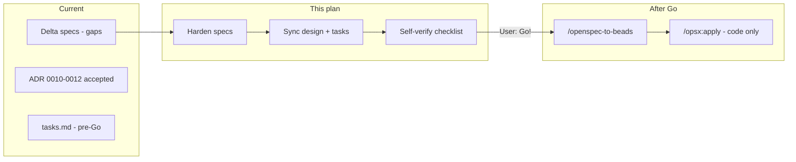

# Spec Quality Hardening — fix-vietnamese-retrieval

## Workflow position

Change is at **artifact review** stage (pre-**Go!**). No [`beads-map.md`](openspec/changes/fix-vietnamese-retrieval/beads-map.md) exists yet — correct per [OpenSpec + Beads golden path](AGENTS.md).



**In scope:** Edit delta specs, minor artifact sync (`design.md`, `tasks.md`, `proposal.md` if needed).  
**Out of scope:** Application code, Beads creation, archive.

**User choices locked in:** locale-aware UI (VI + EN); full depth (P0 + P1 + P2).

---

## Guiding principles for edits

1. **Specs own behavior; ADRs own durable decisions** — fix spec/ADR drift without rewriting ADR files (ADR-0011 already has two normalize functions; spec must mirror).
2. **Every new scenario must be automatable** — replace `MAY` / *"comparable candidates"* with `MUST` + concrete inputs/outputs.
3. **Normative lists live in spec text** — marker lists referenced by constant name + inline enumeration (not "e.g. only").
4. **Cross-capability contracts** — stream `error.code` taxonomy belongs in `rag-chat` before `chatbot-ui` can reference it.

---

## Phase 1 — [`document-retrieval/spec.md`](openspec/changes/fix-vietnamese-retrieval/specs/document-retrieval/spec.md)

### 1.1 Replace ambiguous normalization requirement (P0)

**Problem:** Single requirement conflates dense (keep diacritics) and sparse (fold diacritics).

**Spec change:**
- Rename/split into **`Requirement: Per-leg text normalization before embedding`** aligned with ADR-0011 D2.
- Bind function names: `normalize_for_dense` (NFC + whitespace collapse), `normalize_for_sparse` (NFC + VI diacritic fold).
- Add scenarios:
  - *Distinct ingest inputs per leg* — dense and sparse MUST use different normalized strings from same `chunk.text`; `content` payload unchanged.
  - *Distinct query inputs per leg* — same for `RetrievalService.search()`.
  - *Dense preserves diacritics* — `normalize_for_dense("nghỉ phép")` retains diacritics.
  - *Sparse folds to comparable ASCII* — `normalize_for_sparse("nghỉ phép") == normalize_for_sparse("nghi phep")`.

### 1.2 Golden recall acceptance criteria (P0)

**Problem:** *"comparable candidates"* is not testable.

**Spec change:** Add scenario *Golden diacritic-insensitive recall*:
- **GIVEN** indexed chunk whose `content` contains `nghỉ phép`
- **WHEN** authenticated hybrid query is `nghi phep`
- **THEN** top-5 results MUST include that chunk

Note in scenario: requires post-deploy re-ingest (links to ops scenario below).

### 1.3 Reranker query contract (P1)

**Problem:** Embed uses normalized text; reranker currently receives raw query — undocumented.

**Spec change:** Add to normalization requirement:
- BGE reranker MUST receive the **original contextualized/rewritten query string** (pre-sparse-fold), matching display `content` in payload.

Align [`design.md`](openspec/changes/fix-vietnamese-retrieval/design.md) D2 bullet *"Query: normalize trước embed"* with explicit rerank exception.

### 1.4 Factory symmetry breadth (P1)

**Spec change:** Extend *Query embedding symmetry* requirement:
- All sparse embed call sites (`ingestion_tasks`, `ingestion_service`, `retrieval` router, chatbot router) MUST use `build_embedding_service()` from `embedding_factory.py`.
- Add scenario: *Celery worker uses same factory as API*.

### 1.5 Edge cases and limitations (P2)

Add **`Requirement: Normalization edge cases`** with scenarios:
- *Whitespace-only query* — MUST NOT embed; return empty retrieval / no `EMBEDDING_ERROR`.
- *Long query truncation* — WHEN length exceeds `EMBEDDING_MAX_CHARS` (new config, default TBD in design), MUST truncate before normalize+embed (define rule: truncate tail).
- *Mixed VI-EN query* — ASCII tokens unchanged; VI portion folded on sparse leg only.

Add **`Requirement: Known sparse limitations`** (non-functional):
- Homophone collision after fold (e.g. `da`) is accepted; dense leg responsible for disambiguation.

### 1.6 Re-ingest and partial corpus (P2)

**Spec change:** Extend re-ingest scenario + add:
- *Partial re-ingest degraded recall* — WHEN corpus partially re-ingested, queries MAY miss non-re-ingested docs; ops MUST track `% ready docs re-ingested`.
- *content_hash semantics* — `content_hash` computed from original parsed text, not normalized embed input.

### 1.7 Config and ops observability (P2)

Extend *Sparse embedding model configuration*:
- Startup/health MUST expose `sparse_embedding_model` name for deploy parity checks.
- Scenario: API and worker processes with mismatched `SPARSE_EMBEDDING_MODEL` MUST be caught by integration/deploy checklist (document in `tasks.md` §3.5, not code).

---

## Phase 2 — [`rag-chat/spec.md`](openspec/changes/fix-vietnamese-retrieval/specs/rag-chat/spec.md)

### 2.1 Grade state machine completeness (P0)

**Problem:** Only `is_fallback=false` path specified; `CONFIDENCE_THRESHOLD_FALLBACK=0.60` missing from spec.

**Spec change:** Extend *Language-aware grade confidence gating*:
- WHEN `is_fallback=true`, grade MUST use `normalized_score` vs `CONFIDENCE_THRESHOLD_FALLBACK` (default **0.60**).
- WHEN `is_fallback=false` AND top chunk has `rerank_score`, MUST use raw `rerank_score`.
- WHEN top chunk lacks `rerank_score`, MUST treat as fallback path (`normalized_score`).
- Grade MUST evaluate **top-1 chunk only** after rerank sort.

Add scenario with concrete scores for each branch.

### 2.2 Vietnamese language when router returns `unknown` (P0)

**Problem:** Fallback router always sets `language: unknown` — VI threshold never applies on degraded path.

**Spec change:** Add **`Requirement: Grade language resolution`**:
- Resolution order: router `language` → Vietnamese heuristic on `contextualized_query` → default `unknown`.
- Heuristic rules (normative): presence of VI diacritics OR match against `VI_REWRITE_MARKERS` without EN-primary indicators.
- Scenario: router `unknown` + query `chinh sach` → grade uses `CONFIDENCE_THRESHOLD_VI`.

### 2.3 Normative marker lists (P1)

**Problem:** *"known Vietnamese noise marker (e.g. chinh sach)"* is not testable.

**Spec change:** In *Multilingual query noise and ambiguity heuristics*, embed closed lists:

```
VI_REWRITE_MARKERS: chinh sach, nghi phep, bao hiem, hop dong, quy dinh, nhan vien, luong, phep
VI_AMBIGUOUS_MARKERS: cai nay, cai kia, the con, con cai, cai do
```

(Use normalized lowercase forms consistent with `_classify_query_fallback` matching.)

Replace `MAY classify as clarify` with:
- **WHEN** query contains any `VI_AMBIGUOUS_MARKERS` AND thread history empty → fallback router MUST return `clarify`.

### 2.4 Grade-retry rewrite robustness (P1)

Add scenarios to MODIFIED *Query rewriting* / ADDED grade section:
- *Empty rewrite fallback* — LLM returns empty → `rewritten_query` = `contextualized_query` + language-aware suffix.
- *Rewrite preserves language* — WHEN `language=vi`, rewritten output MUST remain primarily Vietnamese (prompt contract).
- *Audit immutability* — `original_query` and `contextualized_query` MUST NOT be overwritten through retry cycles; retrieval MUST NOT set `current_query` to pollute audit (use `retrieval_query_used` in metadata if needed — spec-level, not implementation detail).

Clarify canonical path: grade-retry behavior defined on **`ChatbotFlowBuilder._rewrite`**; `langgraph_flow.rewrite_query_node` MUST delegate to shared helper or be marked deprecated in design D4.

### 2.5 `mixed` language contract (P2)

Add scenarios:
- Grade: `language=mixed` → use `CONFIDENCE_THRESHOLD` (0.55), not VI.
- Answer: prompt MUST instruct response in user's mixed language, prioritizing Vietnamese if query is primarily VI.

### 2.6 Stream error taxonomy — backend contract (P1)

**Problem:** `chatbot-ui` assumes codes backend does not emit.

**Spec change:** ADD **`Requirement: Stream error classification`** to `rag-chat`:
- `LLM_QUOTA_EXHAUSTED` — quota/rate-limit exceptions from Gemini stream.
- `LLM_STREAM_TIMEOUT` — stream exceeds `STREAM_TIMEOUT_SECONDS`.
- `LLM_GENERATION_FAILED` — other generation failures.
- SSE sequence: `metadata` → `token*` → optional `error` → `done`; `done.status` is source of truth for `partial_success`.

This unblocks `chatbot-ui` requirements.

---

## Phase 3 — [`chatbot-ui/spec.md`](openspec/changes/fix-vietnamese-retrieval/specs/chatbot-ui/spec.md)

### 3.1 Locale-aware notices (P0 — per user choice)

**Problem:** All scenarios mandate Vietnamese only.

**Spec change:** Replace/add scenarios under *Partial success error codes surfaced in UI*:
- WHEN locale is `vi` OR router `language` is `vi` → show VI notice for each `error.code`.
- WHEN locale is `en` → show EN equivalent strings (define normative copy keys: `stream.error.LLM_QUOTA_EXHAUSTED`, etc.).
- Map codes: `LLM_QUOTA_EXHAUSTED`, `LLM_STREAM_TIMEOUT`, `LLM_GENERATION_FAILED`, `NETWORK_INTERRUPTED`.

### 3.2 Distinguish abstain vs generation failure (P2)

Add scenario:
- `low_confidence` abstain MUST use same i18n mechanism as partial_success (not hardcoded EN `ABSTAIN_COPY`).
- Visual distinction: abstain (neutral) vs partial_success (amber warning) — spec-level UX contract.

### 3.3 SSE client edge cases (P2)

Extend MODIFIED *Streaming answers*:
- *Connection lost mid-stream* — no server `error` event → client sets `NETWORK_INTERRUPTED`, keeps partial answer.
- *Event order* — after `error`, client MUST still process `done`; `done` wins for final `status`.

---

## Phase 4 — Cross-artifact sync (no code)

| Artifact | Updates |
|----------|---------|
| [`design.md`](openspec/changes/fix-vietnamese-retrieval/design.md) | Close open question `content_search` → **embed-time only** (resolve in spec). Add D2 rerank query rule, D5 fallback 0.60 in spec pointer, D6 normative marker table, D7 locale-aware copy + backend error taxonomy pointer to rag-chat spec. Add D8 `resolve_grade_language` heuristic. |
| [`tasks.md`](openspec/changes/fix-vietnamese-retrieval/tasks.md) | Add **§1.3 Spec hardening sign-off** checkbox. Extend test tasks: golden recall fixture (3.6), grade language heuristic test (4.9), stream error code API tests (5.3), i18n UI snapshot tests (5.4), `NETWORK_INTERRUPTED` client test (5.5). Add deploy checklist item for `SPARSE_EMBEDDING_MODEL` parity (2.6). |
| [`proposal.md`](openspec/changes/fix-vietnamese-retrieval/proposal.md) | One-line additions: per-leg normalization, golden recall criteria, locale-aware stream errors, grade language heuristic. |
| ADRs 0010–0012 | **No edits** (accepted); specs reference them. Fix drift in specs only. |

---

## Phase 5 — Spec self-verification (pre-Go!)

Run manual checklist (substitute for `/opsx:verify` which targets code):

| Check | Pass criteria |
|-------|---------------|
| ADR alignment | Every ADR decision (D1–D7) has matching requirement + ≥1 scenario |
| Testability | No scenario uses only `MAY` or vague *"comparable"* without measurable outcome |
| Cross-capability | rag-chat stream codes ↔ chatbot-ui error codes ↔ tasks.md §5 |
| Delta format | `## ADDED` / `## MODIFIED`; scenarios use `####` exactly |
| Traceability | New `tasks.md` items map 1:1 to new scenarios |
| Non-goals respected | No Underthesea, no schema change, no new Qdrant payload field |

Deliverable: short **spec review note** in `tasks.md` §1.1 or comment to stakeholder listing closed gaps.

---

## Phase 6 — After user says Go! (Beads — not this plan)

1. User reviews hardened specs → **Go!**
2. Run `/openspec-to-beads fix-vietnamese-retrieval` → epic + phased tasks + `beads-map.md`
3. Implementation via `bd ready` loop only after beads exist

**Do not** run `/opsx:apply` or create Beads until specs pass Phase 5 and user approves.

---

## Suggested edit order (minimize rework)

1. `document-retrieval/spec.md` (normalization + golden recall — foundation)
2. `rag-chat/spec.md` (grade + markers + stream errors)
3. `chatbot-ui/spec.md` (depends on rag-chat error codes)
4. `design.md` open questions + D8
5. `tasks.md` + `proposal.md`
6. Self-verify checklist

---

## Risk if skipped

| Skipped item | Impact at apply time |
|--------------|---------------------|
| Per-leg normalization | Wrong single-path impl; VI recall still broken |
| Grade `unknown` heuristic | `CONFIDENCE_THRESHOLD_VI` dead code on real traffic |
| Stream error in rag-chat only | UI spec untestable; `/opsx:verify` fails coherence |
| Golden recall scenario | No objective done criteria for core bug fix |
